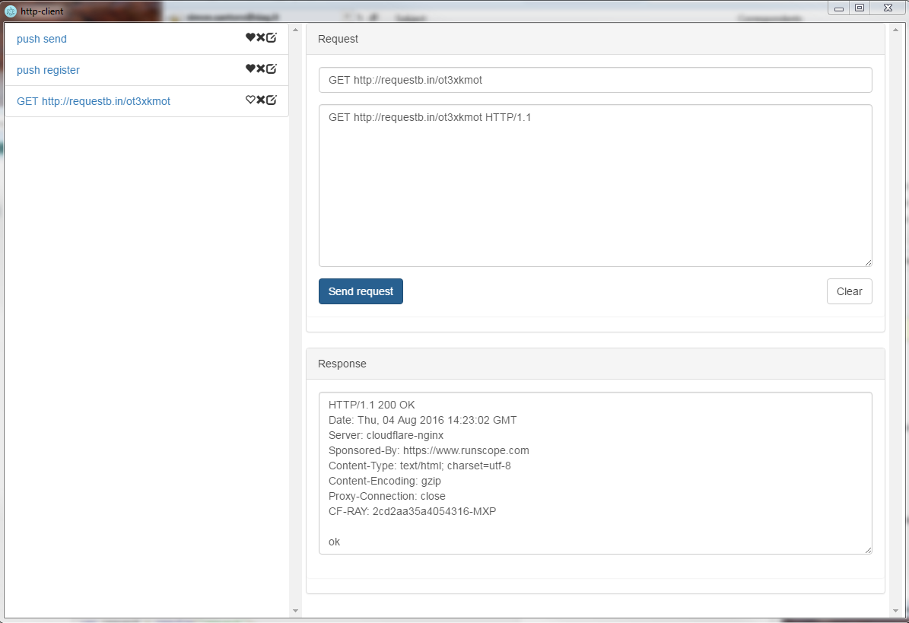

# http-client

A very simple electron app that can send raw http requests

## how to run

```
git clone https://github.com/S2-/http-client.git
cd http-client
npm install
node_modules\.bin\electron .
```

## screenshot


## download
Latest release: https://github.com/S2-/http-client/releases
